# 📊 Statistical Modeling of Calorie Burn in Gym Workouts

## 👩‍🌾 Author

**Natali Kostadinovic**  
**Date:** December 2, 2024

---

## 📊 Project Overview

This project investigates how personal characteristics and workout choices influence **calorie burn during gym workouts**. Using a simulated but realistic dataset, we use **regression modeling** to answer:

> **Which variables significantly affect the number of calories burned in a workout?**

The analysis covers:

- Data cleaning and transformation
- Regression model fitting
- Assumption diagnostics
- Outlier detection
- Model selection using BIC

---

## 📃 Dataset Overview

- **Source:** [Kaggle Gym Members Dataset](https://www.kaggle.com/datasets/valakhorasani/gym-members-exercise-dataset)
- **Sample size:** 973 gym members
- **Key variables:**
  - `Calories_Burned` (Response)
  - `Age`, `Gender`, `Workout_Type`, `Session_Duration`, `Fat_Percentage` (Predictors)

---

## 📈 Exploratory Data Analysis

### 📷 Pairwise Plot of Key Variables (Before Transformation)

Shows relationships between `Calories_Burned`, `Age`, `Session_Duration`, `Fat_Percentage`, `Gender`, and `Workout_Type`.

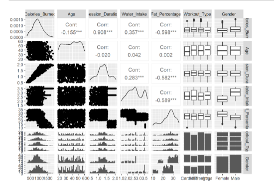

Initial diagnostics showed skewed residuals and heteroscedasticity, prompting **log and square root transformations** for normalization.

---

## 🔢 Model Building

### ✏️ Final Regression Model:

```r
lm(log_Calories_Burned ~ Age + log(Session_Duration) + Gender, data = gym)
```

### 🔢 Regression Equation (Back-transformed):

\[ \hat{\mu}_{\log(Calories\ Burned)} = 6.653 - 0.0034 \cdot Age + 1.0039 \cdot \log(Session\ Duration) + 0.098 \cdot Gender_{Male} \]

### 📊 Key Findings:

- **Age:** Older individuals burn slightly fewer calories (negative slope)
- **Session Duration:** Longer sessions strongly increase calorie burn
- **Gender:** Males burn more calories than females on average

---

## 🔍 Assumption Checks

- **Linearity:** Met after transformations
- **Normality:** Residuals approx. normal
- **Homoscedasticity:** Improved after transformation
- **Independence:** Assumed
  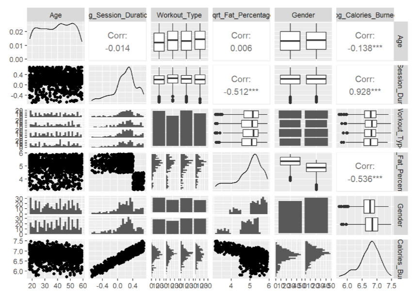

### 📷 Residual Diagnostics Plots

Check for normality and homoscedasticity of residuals.

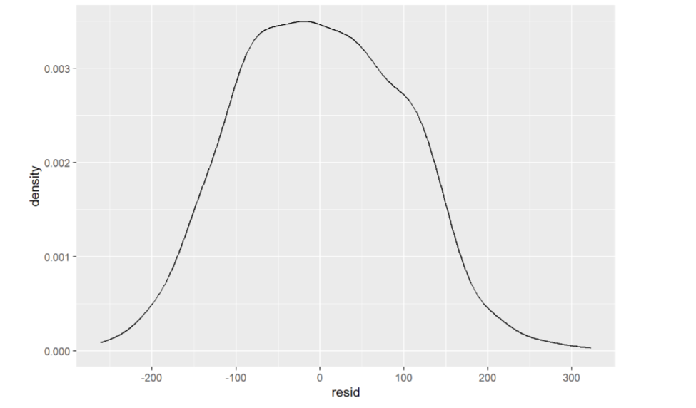

---

## 🔧 Outlier Diagnostics

Using Cook’s Distance, Leverage, and Studentized Residuals:

- 16 potential outliers identified
- Removing them **did not substantially change model estimates or p-values**

### 📷 Outlier Detection Visuals

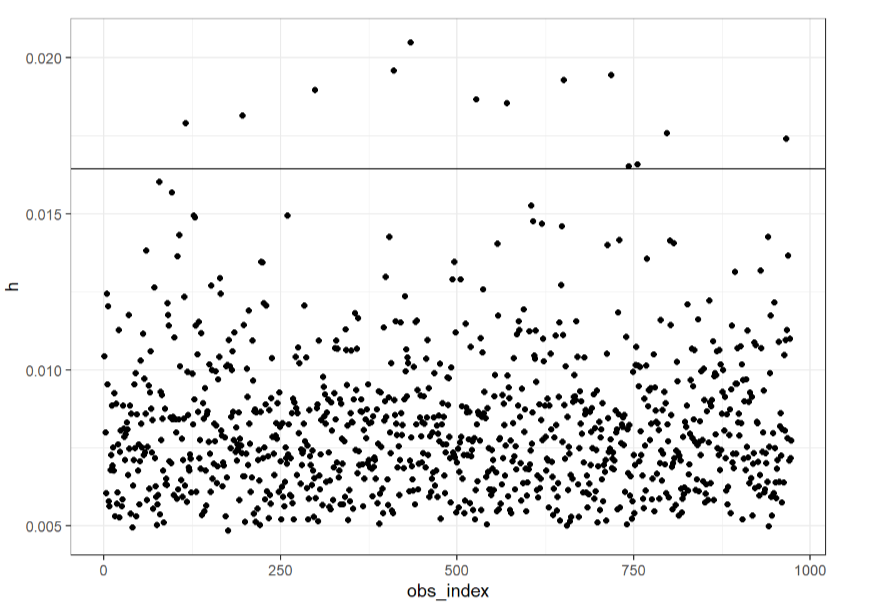  
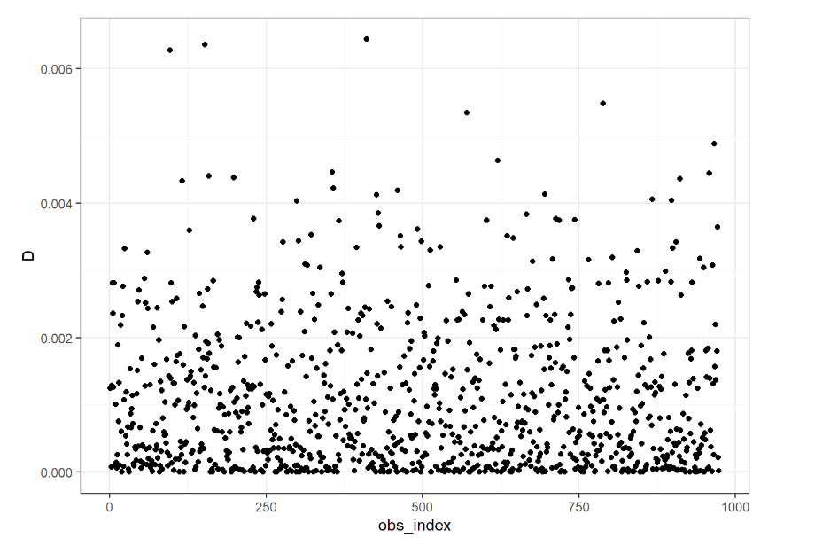  
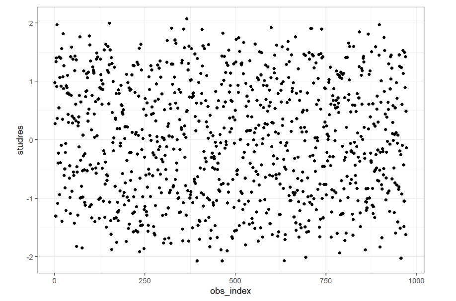

---

## 🥇 Model Selection via BIC

Models compared using `regsubsets()` and **Bayesian Information Criterion (BIC)**.

### 📷 BIC Plot for Model Selection

Shows which models performed best based on the BIC values.

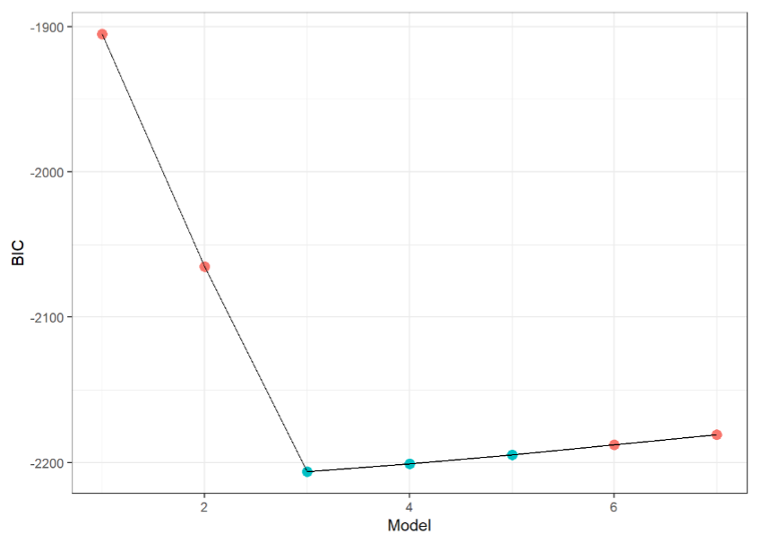

- **Model 3** selected:
  - Predictors: `Age`, `log(Session_Duration)`, `Gender`
  - **Lowest BIC (-2206.404)**
  - Other models added workout types but with no significant improvement

---

## 🔍 Hypothesis Testing (5% Level)

| Predictor               | p-value | Conclusion                    |
| ----------------------- | ------- | ----------------------------- |
| Age                     | < 2e-16 | Significant (negative effect) |
| Session Duration        | < 2e-16 | Strong positive effect        |
| Gender (Male vs Female) | < 2e-45 | Males burn more calories      |

---

## 📅 Final Model Interpretation

> **Each additional year of age** reduces log(calories burned) by ~0.0034 units.  
> **Longer workouts** (via log-transformed duration) strongly increase calorie burn.  
> **Males** burn about **0.098 more log-calories** than females, on average.

### 📊 VIF Check for Multicollinearity

- All Variance Inflation Factors (VIFs) < 1.01 ➔ No multicollinearity issue
  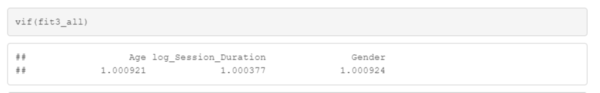

### 📷 Model Summary Output

Output from `summary(lm(...))` showing coefficients, p-values, and model fit.

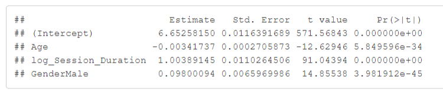

---

## 📈 Summary Table

| Metric                | Estimate | Significance |
| --------------------- | -------- | ------------ |
| Intercept             | 6.653    | \*\*\*       |
| Age                   | -0.0034  | \*\*\*       |
| log(Session_Duration) | 1.0039   | \*\*\*       |
| GenderMale            | 0.098    | \*\*\*       |

---

## 📊 Conclusions

- ❌ **Age**: Slightly lowers calories burned
- ✅ **Session Duration**: Major factor in calorie expenditure
- ♂️ **Gender**: Males burn more than females
- ❌ **Workout Type**: Not significant after adjusting for others
- ✅ **Model 3** offers best balance of accuracy and simplicity
- ✅ **Model 3** the identified outliers did not have a significant influence on the model selection, coefficient estimates, or p-values. Therefore, the final model (Model 3) is considered robust and reliable with respect to potential outliers.

---

## 🔍 Interaction Effects Visualization

### 📷 Interaction Effects Plot

We visually assessed potential interaction effects between predictors (e.g., Age, Fat Percentage, Session Duration) and categorical variables such as Gender and Workout Type. The absence of parallel slopes suggested the possibility of interaction terms. However, upon fitting models with interactions, the results did not show statistically significant interaction effects, and the added complexity did not substantially improve model performance. Therefore, we proceeded with a more parsimonious model without interaction terms.

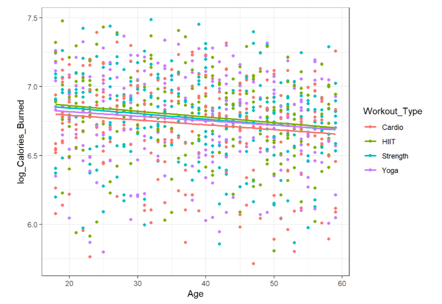
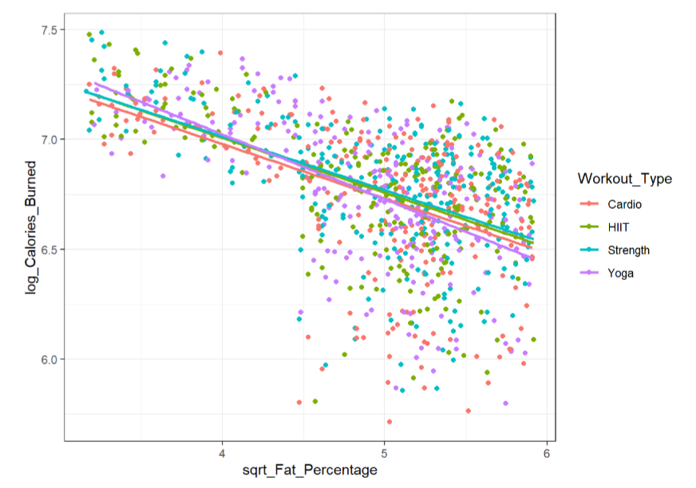
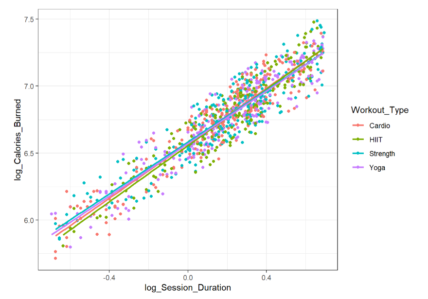

---

## 🔍 Future Directions

- Test with real-world biometric data (e.g., Apple Watch or Fitbit)
- Expand model to include dietary factors or fitness levels
- Explore non-linear or mixed-effects models for individual tracking

---
